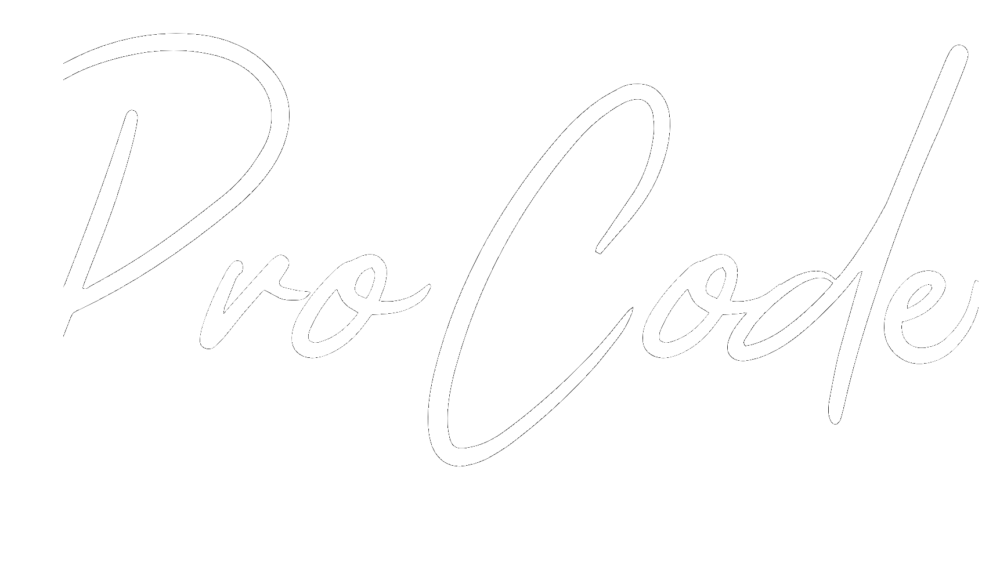
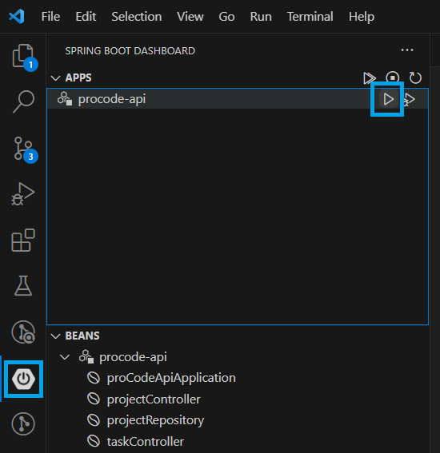

<a name="readme-top"></a>

[![Contributors][contributors-shield]][contributors-url]
[![Forks][forks-shield]][forks-url]
[![Stargazers][stars-shield]][stars-url]
[![Issues][issues-shield]][issues-url]
[![LinkedIn][linkedin-shield]][linkedin-url]

<br />
<div align="center">
  <a href="https://github.com/samuel-tmd/proCode">
    
  </a>

  <h3 align="center">ProCode</h3>

  <p align="center">
    O sistema de gerenciamento de projeto que sua empresa precisa. 
    <br />
    <br />
    <a href="https://github.com/samuel-tmd/proCode"><strong>Explore os documentos »</strong></a>
    <br />
    <a href="https://github.com/samuel-tmd/proCode/issues">Reportar Bug</a>
    ·
    <a href="https://github.com/samuel-tmd/proCode/issues">Solicitar Funcionalidade</a>
    <br />
    <br />
    Responsável: 
    <br />
    Samuel Teodoro Moreira Dias
    <br />
    RA: 202106783
  </p>
</div>

<!-- TABLE OF CONTENTS -->
<details>
  <summary>Resumo</summary>
  <ol>
    <li>
      <a href="#about-the-project">Sobre o projeto</a>
      <ul>
        <li><a href="#built-with">Construído com</a></li>
      </ul>
    </li>
    <li>
      <a href="#getting-started">Iniciando</a>
      <ul>
        <li><a href="#prerequisites">Pré-requisitos</a></li>
        <li><a href="#installation">Instalação</a></li>
      </ul>
    </li>
    <li><a href="#usage">Como utilizar</a></li>
    <li><a href="#contact">Contato</a></li>
    <li><a href="#acknowledgments">Reconhecimentos</a></li>
  </ol>
</details>

## Sobre o projeto

Existem muitos softwares de gerenciamento de projeto hoje em dia mas, o desenvolvedor de software sempre precisa do melhor. Poucos oferecem segurança, visibilidade, facilidade e intuitividade como o ProCode. 

<p align="right">(<a href="#readme-top">voltar ao início</a>)</p>

### Construído com

Abaixo estão listadas as tecnologias utilizadas para implementar o ProCode.

[![Java][Java]][Java-url] <br>
[![VSCode][VSCode]][VSCode-url] <br>
[![SpringBoot][SpringBoot]][SpringBoot] <br>
[![H2 Database][H2-Database]][H2-Database-url] <br>
[![Lombok][Lombok]][Lombok-url] <br>

A linguagem escolhida foi o Java pois juntamente com o Spring Boot, facilita a criação de servidores e APIs poderosas e em pouco tempo. Já o VS Code foi escolhido por ser a IDE mais conhecida e versátil do mercado. H2 Database é um banco de dados amplamente utilizado com o Spring Boot, que armazena os dados em memório e é facilmente gerenciago pela linguagem Java. E, finalmente, o Lombok, é um framework Java que acelera o desenvolvimento, poupando tempo e linhas de código.

### Arquitetura

O ProCode tem 2 módulos, Projetos e Tarefas. As tarefas são relacionadas aos projetos, e uma tarefa pode ter somente um projeto relacionado, mas os projetos podem ter infinitas tarefas relacionadas.

As classes estão dividas em 3 pastas: Controller, Model e Repository.
* Classes da pasta Controller são classes que recebem as chamadas REST para o determinado módulo. ProjectController para Porjetos e TaskController para Tarefas.
  
* Classes da pasta Model são classes que dão forma a um objeto do sistema, contém seus atributos e métodos específicos. Não foi necessário criar getters e setter pois a extensão Lombok foi utlizada. Project modela os Projetos e Task modela as Tarefas.
  
* Classes da pasta Repository, são classes mantém os métodos e atributos necessários para gerenciar o banco de dados para uma determinada entidade. ProjectRepository gerencia os Projetos e TaskRepository gerencia as Tarefas.


<p align="right">(<a href="#readme-top">voltar ao início</a>)</p>

## Iniciando

Siga os passos abaixo para utilizar nosso projeto.

### Pré-requisitos

1. Instale um java JDK na sua máquina. [Baixe uma JDK](https://www.oracle.com/java/technologies/javase/jdk17-archive-downloads.html)
2. Instale o Git. [Baixe o Git](https://git-scm.com/)
3. Instale o VS Code. [Baixe o VS Code](https://code.visualstudio.com/)
4. No VS Code instale as extensões: [Extension Pack for Java](https://marketplace.visualstudio.com/items?itemName=vscjava.vscode-java-pack), [Language Support for Java(TM) by Red Hat](https://marketplace.visualstudio.com/items?itemName=redhat.java), [Maven for Java](https://marketplace.visualstudio.com/items?itemName=vscjava.vscode-maven), [Spring Boot Extension Pack](https://marketplace.visualstudio.com/items?itemName=vmware.vscode-boot-dev-pack)

### Instalação

1. Clone o repositório
   ```sh
   git clone https://github.com/samuel-tmd/proCode.git
   ```

<p align="right">(<a href="#readme-top">voltar ao início</a>)</p>

## Como utilizar

Para iniciar a API, entra na nova aba da Extensão Spring Boot Dashboard e inicie a API clicando no botão PLAY.

<div align="center">
  
</div>

Após isso, utilize o [Postman](https://www.postman.com/) para chamar as APIs. O endpoint base é o http://localhost:8080. O ProCode disponibiliza 8 APIs para uso completo de suas funcionalidades, são estas: Listar Projetos, Criar um Projeto, Atualizar um Projeto, Deletar um Projeto, Listar Tarefas, Criar uma Tarefa, Atualizar uma Tarefa, Deletar uma Tarefa.

#### Módulo de Projetos: 

1. Listar Projetos
    * Descrição: Retorna uma lista de objetos do tipo projeto.
    * Método: GET
    * Endpoint: /projetos
    * Resposta bem sucedida (Exemplo 1):
      * Status Code: 200 OK 
    ```sh
    {
      "data": []
    }
    ```
    * Resposta bem sucedida (Exemplo 2) (Projeto sem tarefas):
      * Status Code: 200 OK
    ```sh
    {
      "data": [
        {
          "id": 1,
          "name": "Meu Projeto",
          "tasks": []
        }
      ]
    } 
    ```
    * Resposta bem sucedida (Exemplo 3) (Projeto com tarefas):
      * Status Code: 200 OK
    ```sh
    {
      "data": [
        {
          "id": 1,
          "name": "Meu Projeto",
          "tasks": [
            {
              "id": 1,
              "subject": "Criar tela de login",
              "description": "Deve obter campos para inerção de usuário e senha",
              "assignedTo": "Samuel",
              "projectId": 1
            }
          ]
        }
      ]
    } 
    ```
2. Criar um Projeto
    * Descrição: Cria um projeto no banco de dados e retorna o objeto do projeto.
    * Método: POST
    * Endpoint: /projetos
    * Corpo: 
    ```sh
    {
      {
        "name": "Meu Projeto"
      }
    }
    ```
    * Resposta bem sucedida:
      * Status Code: 201 Created
    ```sh
    {
      "data": {
        "id": 1,
        "name": "Meu Projeto",
        "tasks": []
      }
    }
    ```
3. Atualizar um Projeto
    * Descrição: Atualiza um projeto no banco de dados e retorna o objeto do projeto atualizado. O Id do projeto é obrigatório no corpo da requisição.
    * Método: PATCH
    * Endpoint: /projetos
    * Corpo: 
    ```sh
    {
      {
        "id": 1,
        "name": "Meu Projeto"
      }
    }
    ```
    * Resposta bem sucedida:
      * Status Code: 200 OK
    ```sh
    {
      "data": {
        "id": 1,
        "name": "Meu Projeto",
        "tasks": []
      }
    }
    ```
4. Deletar um Projeto
    * Descrição: Deleta um projeto no banco de dados e não retona nada. O Id do projeto é obrigatório no corpo da requisição.
    * Método: DELETE
    * Endpoint: /projetos
    * Corpo: 
    ```sh
    {
      {
        "id": 1
      }
    }
    ```
    * Resposta bem sucedida:
      * Status Code: 204 No Content

#### Módulo de Tarefas: 

1. Listar Tarefas
    * Descrição: Retorna uma lista de objetos do tipo tarefa.
    * Método: GET
    * Endpoint: /tarefas
    * Resposta bem sucedida:
      * Status Code: 200 OK
    ```sh
    {
      "data": []
    }
    ```
    * Resposta bem sucedida (Exemplo 2):
      * Status Code: 200 OK
    ```sh
    {
      "data": [
        {
          "id": 1,
          "subject": "Criar tela de login",
          "description": "Deve obter campos para inerção de usuário e senha",
          "assignedTo": "Samuel",
          "projectId": 1
        }
      ]
    }
    ```
2. Criar uma Tarefa
    * Descrição: Cria uma tarefa no banco de dados e retorna o objeto da tarefa.
    * Método: POST
    * Endpoint: /tarefas
    * Corpo: 
    ```sh
    {
      "subject": "Criar tela de login",
      "description": "Deve obter campos para inerção de usuário e senha",
      "assignedTo": "Samuel",
      "projectId": 1
    }
    ```
    * Resposta bem sucedida:
      * Status Code: 201 Created
    ```sh
    {
      "data": {
        "id": 1,
        "subject": "Criar tela de login",
        "description": "Deve obter campos para inerção de usuário e senha",
        "assignedTo": "Samuel",
        "projectId": 1
      }
    }
    ```
3. Atualizar uma Tarefa
    * Descrição: Atualiza uma tarefa no banco de dados e retorna o objeto da tarefa atualizado. O Id da tarefa é obrigatório no corpo da requisição. O Id do projeto é obrigatório no corpo da requisição. Não é possível trocar a tarefa de projeto.
    * Método: PATCH
    * Endpoint: /tarefas
    * Corpo: 
    ```sh
    {
      "id": 1,
      "subject" : "Criar tela de login",
      "description": "Deve obter campos para inerção de usuário e senha e botão 'Entrar'",
      "assignedTo": "Samuel",
      "projectId": 1
    }
    ```
    * Resposta bem sucedida:
      * Status Code: 200 OK
    ```sh
    {
      "data": {
        "id": 1,
        "subject": "Criar tela de login",
        "description": "Deve obter campos para inerção de usuário e senha e botão 'Entrar'",
        "assignedTo": "Samuel",
        "projectId": 1
      }
    }
    ```
4. Deletar uma Tarefa
    * Descrição: Deleta uma tarefa no banco de dados e não retona nada. O Id da tarefa é obrigatório no corpo da requisição. O Id da tarefa é obrigatório no corpo da requisição. O Id do projeto é obrigatório no corpo da requisição.
    * Método: DELETE
    * Endpoint: /tarefas
    * Corpo: 
    ```sh
    {
      "id": 1,
      "projectId": 1
    }
    ```
    * Resposta bem sucedida:
      * Status Code: 204 No Content

### Erros: 

As respostas com erro devem vir formatadas da seguinte maneira, onde o valor do atributo "message" informa o motivo do erro:
```sh
{
    "message": ""
}
```
Abaixo estão listadas algumas das mensagens de erro conhecidas:
* O Id de uma entidade não pode ser nulo:
  ```sh
  {
      "message": "Id cannot be null"
  }
  ```
* O Id do projeto em uma tarefa não pode ser nulo:
  ```sh
  {
    "message": "ProjectId cannot be null"
  }
  ```
* Não é possível trocar uma tarefa de projeto:
  ```sh
  {
    "message": "It's not possible to change the Task's Project"
  }
  ```
* Projeto não encontrado
  ```sh
  {
    "message": "Project not found"
  }
  ```
* Tarefa não encontrado
  ```sh
  {
    "message": "Task not found"
  }
  ```
* Algum atributo obrigatório é nulo:
  ```sh
  {
    "message": "not-null property references a null or transient value : com.procode.pmt.model.XXX.xxx"
  }
  ```
<p align="right">(<a href="#readme-top">voltar ao início</a>)</p>

## Contact

Samuel Dias - [Samuel Dias][linkedin-url]

Email: samuel_tmdias@hotmail.com

Project Link: [https://github.com/samuel-tmd/proCode](https://github.com/samuel-tmd/proCode)

<p align="right">(<a href="#readme-top">back to top</a>)</p>

[contributors-shield]: https://img.shields.io/github/contributors/samuel-tmd/proCode.svg?style=for-the-badge
[contributors-url]: https://github.com/samuel-tmd/proCode/graphs/contributors
[forks-shield]: https://img.shields.io/github/forks/samuel-tmd/proCode.svg?style=for-the-badge
[forks-url]: https://github.com/samuel-tmd/proCodenetwork/members
[stars-shield]: https://img.shields.io/github/stars/samuel-tmd/proCode.svg?style=for-the-badge
[stars-url]: https://github.com/samuel-tmd/proCode/stargazers
[issues-shield]: https://img.shields.io/github/issues/samuel-tmd/proCode.svg?style=for-the-badge
[issues-url]: https://github.com/samuel-tmd/proCode/issues
[linkedin-shield]: https://img.shields.io/badge/-LinkedIn-black.svg?style=for-the-badge&logo=linkedin&colorB=555
[linkedin-url]: https://www.linkedin.com/in/samuel-dias4a5a/
[product-screenshot]: images/screenshot.png
[Java]: https://img.shields.io/badge/Java-ED8B00?style=for-the-badge&logo=openjdk&logoColor=white
[Java-url]: https://java.com/
[SpringBoot]: https://img.shields.io/static/v1?style=for-the-badge&message=Spring+Boot&color=6DB33F&logo=Spring+Boot&logoColor=FFFFFF&label=
[SpringBoot-url]: https://spring.io/projects/spring-boot
[VSCode]: https://img.shields.io/badge/Vscode-007ACC?style=for-the-badge&logo=visualstudiocode&logoColor=white
[VSCode-url]: https://code.visualstudio.com/
[H2-Database]: https://img.shields.io/badge/H2%20Database-ff0000?style=for-the-badge
[H2-Database-url]: https://www.h2database.com/html/main.html
[Lombok]: https://img.shields.io/badge/Lombok-000000?style=for-the-badge
[Lombok-url]: https://projectlombok.org/